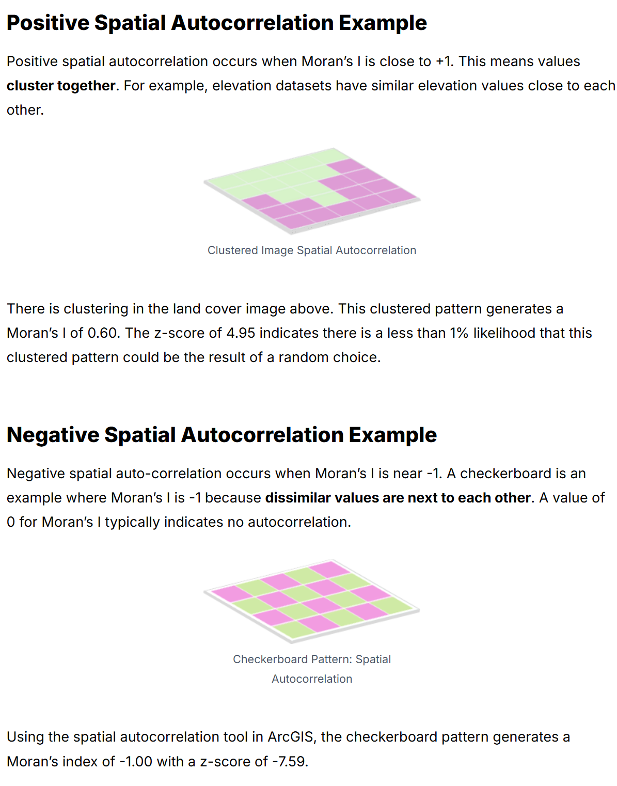

# 08: Geostatistics - spatiotemporal analysis, spatial autocorrelation, interpolation

UW Geospatial Data Analysis  
CEE467/CEWA567  
David Shean, Eric Gagliano, Quinn Brencher

## Overview

Now that we've learned the basics of vector, raster, and nDarray operations, this week we'll focus on geostatistics to analyze spatial patterns and relationships in geographic data. Geostatistics provides powerful methods for understanding spatial dependency, detecting patterns, and making predictions across geographic space. In this week's lab, we will practice these concepts with data from the SNOTEL automatic weather station network, beginning with temporal correlation, building to temporal and spatial autocorrelation, reviewing common exploratory spatial data analysis approaches, and ending with spatial interpolation methods.

## Geostatistics

We differentiate geostatistics from statistics by its explicit consideration of spatial location and relationships. While traditional statistics often assumes observations are independent and identically distributed, geostatistics acknowledges that geographic data violates this assumption due to spatial autocorrelation. Geostatistics provides specialized techniques to analyze and model these spatial dependencies.

    
Source: https://freshbiostats.wordpress.com/wp-content/uploads/2013/03/spatial_map2.png

### Tobler's first law of geography
In a [1970 publication on urban growth in Detroit](https://doi.org/10.2307/143141), Waldo Tobler coined and invoked the [First Law of Geography](https://en.wikipedia.org/wiki/Tobler%27s_first_law_of_geography), stating that "everything is related to everything else, but near things are more related than distant things.". This principle forms the foundation of geostatistics, acknowledging that observations in space tend to be related, with the strength of the relationship often decreasing with distance.

  
Source: https://mgimond.github.io/Spatial/img/Random_maps.png

## Exploratory spatial data analysis
### From correlation to autocorrelation 

Traditional correlation measures statistical relationships between different variables. Typically, we measure the degree to which variables are linearly related using the [Pearson correlation coefficient](https://en.wikipedia.org/wiki/Pearson_correlation_coefficient). Autocorrelation refers to the correlation of a variable with itself across space or time. Temporal autocorrelation quantifies how similar observations are based on a lag time, wheras spatial autocorrelation quantifies how similar observations are based on their spatial proximity.

Positive temporal autocorrelation indicates some sort of repeating pattern in time (e.g. hourly air temperature with a lag time of 24 hours), and no temporal autocorrelation suggests a process that is not time dependent.

Positive spatial autocorrelation indicates that similar values tend to cluster together (e.g. snow depth), while negative spatial autocorrelation shows a pattern where dissimilar values are near each other (e.g. a checkerboard pattern). The absence of spatial autocorrelation suggests a random spatial distribution.

   
Source: https://emilkirkegaard.dk/en/wp-content/uploads/SAC_illu.png

### Quantifying spatial autocorrelation: Global Moran's I

To quantify spatial autocorrelation, we'll often use Global Moran's I and Local Moran's I. Global Moran's I varies from -1 to 1, and yields one summary statistic for your entire dataset, and is best when your dataset is homogenous and you don't expect local dependencies.

Source: https://gisgeography.com/spatial-autocorrelation-moran-i-gis/

    
Source: https://blasbenito.github.io/spatialRF_talk/talk.html#1 

### Quantifying spatial autocorrelation: Local Moran's I

Even if you expect your dataset to be homogenous, you still might want to look at a more localized measure of spatial autocorrelation. Local Moran's I does this, yielding a statistic at each sampled point, facilitating the identification of clusters and outliers.

    
Source: https://geodacenter.github.io/workbook/6a_local_auto/lab6a.html

### Quantifying spatial variability: Semivariograms

The semi-varigoram is an important tool in geostatistics that quantifies the spatial dependence of a variable by measuring and modeling variance as a function of lag distance. Typically, we create a semivariogram by sampling pairs of data points, and then we fit a mathematical function to these points. There are 3 important variogram parameters...

- sill: semivariance level where there is no spatial correlation
- range: distance where there is spatial correlation
- nugget: measurement error or small spatial scale variance

  
Source: http://dx.doi.org/10.15446/esrj.v18n2.41173 

Check out the fantastic [GeostatsPy demo notebook on variograms](https://geostatsguy.github.io/GeostatsPyDemos_Book/GeostatsPy_variogram_calculation.html). We won't be using the package used in this notebook, but the introductory material is great for understanding variograms--why we use them, how we use them, and the underlying assumptions of variography.

## Spatial interpolation methods

Spatial interpolation allows us to estimate values at locations with no data based on observed values at known locations. Spatial interpolation is important for when we'd like to create continuous surfaces from point observations, or for when we'd like to predict values at unsampled locations. The most common techniques can be divided into deterministic methods, geostatistical / probabalistic methods, and machine learning approaches.

    
Source: https://www.neonscience.org/resources/learning-hub/tutorials/spatial-interpolation-basics

  
Source: https://www.neonscience.org/resources/learning-hub/tutorials/spatial-interpolation-basics

### Deterministic vs Geostatistical methods

The main difference between deterministic interpolation methods and geostatistical / Kriging methods has to do with how weighting scheme. Deterministic methods will specify a mathematical formula for how weighting changes over distances (e.g. inverse distance weighting), whereas geostatistical methods determine optimal weights based on the spatial correlation structure (quantified by the semivariogram), allowing for accounting of directional dependences (anisotropy). Geostatistical methods can also provide prediction uncertainty estimates at each location, though they are usually more computationally expensive. Check out [this page](https://pro.arcgis.com/en/pro-app/latest/tool-reference/3d-analyst/how-kriging-works.htm 
) on how the variogram and Kriging methods are related.

  
Source: https://trangthuyvo.wordpress.com/2018/09/05/difference-between-idw-and-kriging-variogram-graph/    
 
Source: https://www.youtube.com/watch?v=aSr9KzrgsGY

## Other resources

### Time-series resources
* [Data Science Handbook: Working with time-series](https://jakevdp.github.io/PythonDataScienceHandbook/03.11-working-with-time-series.html)
* [Pandas time-series](https://pandas.pydata.org/docs/user_guide/timeseries.html)
* [Xarray time-series](https://xarray.pydata.org/en/stable/user-guide/time-series.html)

### Spatial interpolation
* 1D vs. 2D interpolation
* https://docs.scipy.org/doc/scipy/tutorial/interpolate.html  

### Independent time series correlation
* https://en.wikipedia.org/wiki/Pearson_correlation_coefficient
* https://pandas.pydata.org/docs/reference/api/pandas.DataFrame.corr.html

### Spatial autocorrelation
* https://geostat-framework.readthedocs.io/projects/gstools/en/stable/
* http://darribas.org/gds15/content/labs/lab_06.html 
* http://darribas.org/gds_scipy16/ipynb_md/04_esda.html

### Temporal autocorrelation and seasonality
* https://knowledge.dea.ga.gov.au/notebooks/How_to_guides/Detecting_seasonality/